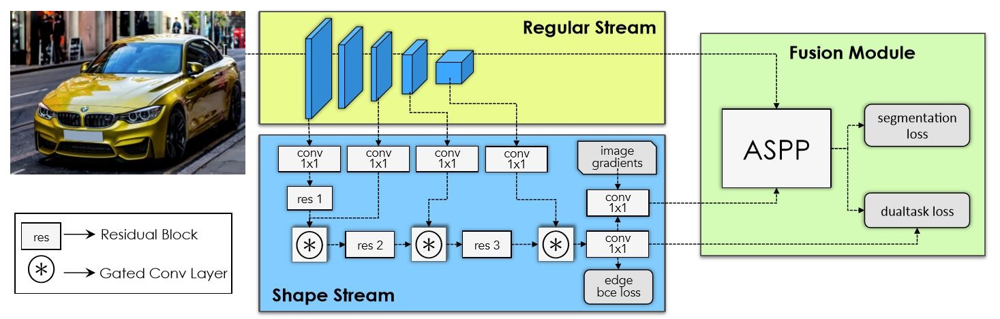
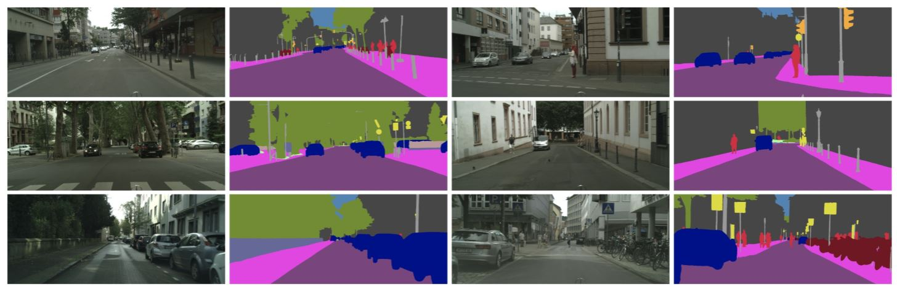
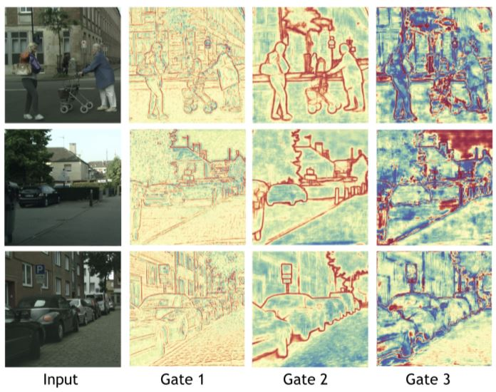

# Note-for-GSCNN
make some notes for GSCNN

论文名称：Gated-SCNN: Gated Shape CNNs for Semantic Segmentation

论文地址：[https://arxiv.org/abs/1907.05740](https://arxiv.org/abs/1907.05740)

代码地址：[https://github.com/nv-tlabs/gscnn](https://github.com/nv-tlabs/gscnn)

这篇文章是发表在即将召开的ICCV2019上的一篇关于语义分割的最新论文。作者认为之前语义分割的工作将所有的信息，包括形状，颜色和纹理，都放入到了CNN网络中用来做识别，但是这可能并不是最理想的方法，因为在语义分割任务中，我们需要更加关注物体的边界信息以得到物体的形状，而颜色和纹理信息相对来说就比较low-level一点了。所以，作者提出了two stream的方法，在regular stream的基础之上增加了一个shape stream，并通过门控卷积来控制使得shape stream这条分支中只学习有关边界的信息。

具体网络结构如下图：

网络一共分三个模块：Regular Stream, Shape Stream, Fusion Model。

- Regular Stream：作者选择用ResNet或WideResNet的预训练模型，输入为原图像I，输出的结果r相对输入图像尺寸下采样m倍。

- Shape Stream：输入为图像的梯度（用Canny算子来实现）$\nabla I$和Regular Stream的第一个卷积块的输出。通过门控卷积层来控制其只传输boundary相关的信息，用原文的话来说，门控卷积层可以看成是两个stream之间的一个collaboration。Regular stream，可以看成是一个经验老道的长者，它已经对一幅图像的高层语义信息有了深入的了解，这样再把自己的经验传授给Shape stream，就可以让后生少走点弯路，通过门控层GCL指导Shape stream关闭与高层语义信息不相关的激活值，从而只关注与边界有关的信息。定义Shape stream的输出为s，即一个binary mask（属于边界的概率），对该模块的监督使用二值交叉熵损失（binary cross entropy loss)，而groundtruth可以通过GT semantic segmentation mask获得。

- Fusion Module：将regular和shape的输出放入到ASPP模块之中$f=F_\gamma(s,r)\in R^{K\times H\times W}$，其中K为输入图像包含物体的类别数。

  

Gated Convolutional Layer：self-attention的方法，希望通过regular stream中high-level的信息通过交互来保证shape stream只关注boundary相关的信息。具体的实现方法：

1. 首先通过两个stream的输出来得到attention map：
   $$
   \alpha_t=\sigma(C_{1\times1}(s_t||r_t))
   $$

2. shape stream输出与attention map点乘并通过residual block，再与channel-wise的权重相乘：
   $$
   s_t'=((s_t\odot \alpha_t)+s_t)^T w_t
   $$
   

实验结果：

作者还给出了GCL门控单元作用的可视化，如下图所示。Gate 1只关注了low-level的边缘，而Gate 2和Gate 3则更加关注object-level的边缘信息。通过GCL，可以得到更加refine的分割结果。

Word and Expression：

- in parallel to 与...并行
- showcase 展示
- This enables us to use a very shallow architecture for the shape stream.
- boost performance 提升性能
- to name a few 仅举几例
- led to dramatic improvements
- we argue here that 提出自己的观点和看法
- by doing so 可以做连接
- plug-and-play 即插即用
- we propose a new two-stream CNN architecture that explicitly wires shape information as a separate processing branch.
- Cityscapes dataset: it contains images from 27 cities in Germany and neighboring countries. It contains 2975 training, 500 validation and 1525 test images.

